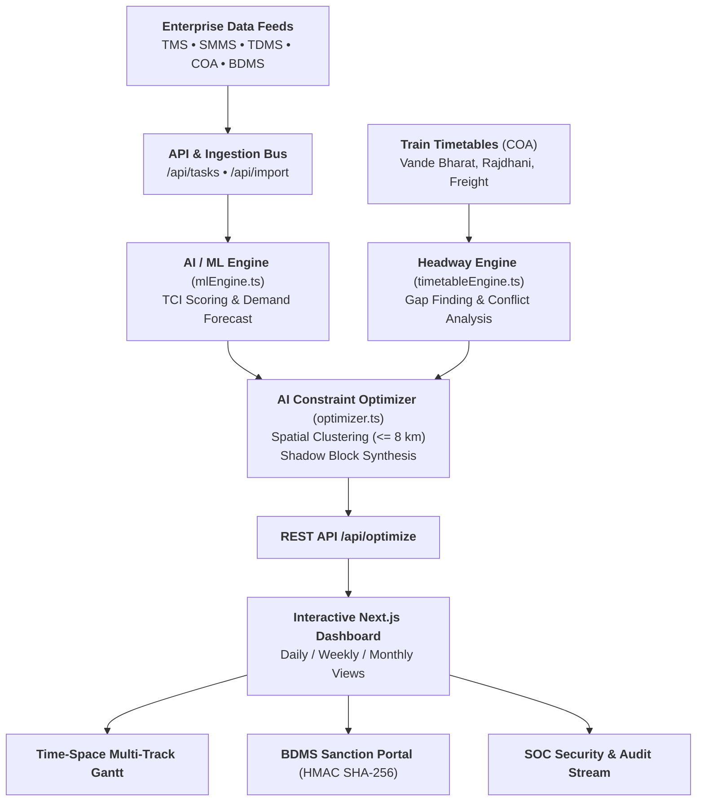

# 🚆 Indian Railways AI-Powered Automatic Block Planning System
### Smart India Hackathon / Problem Statement ID: 26027

> **AI-Powered Automatic Block Planning to Maximize Asset Availability for Train Operations on Indian Railways**  
> Organization: **Ministry of Railways** • Theme: **Transportation & Logistics**

---

## 🌟 Executive Overview

In Indian Railways, fixed infrastructure maintenance for **Civil Engineering (TMS)**, **Traction Distribution / 25kV OHE (TDMS)**, and **Signal & Telecommunication (SMMS)** has historically been requested independently through the **BDMS** system. Uncoordinated planning results in repeated track disconnections, speed restrictions (TSR), delayed passenger trains, and lost freight revenue.

This system replaces decentralized manual planning with an **AI-driven, multi-department spatial-temporal optimization platform**:
1. **Multi-System Enterprise Ingestion**: Connects defect feeds from **TMS**, **SMMS**, **TDMS**, **COA**, and **BDMS**.
2. **AI Track Criticality Index (TCI: 0-100)**: Machine Learning multi-feature scoring model evaluating severity, exponential overdue decay, speed restriction severity ($\Delta v_{\text{TSR}}$), traffic density, and 25kV OHE power block necessity.
3. **Train Timetable Headway Constraint Engine**: Integrates passenger express (Vande Bharat, Rajdhani) as hard constraints and freight trains as regulatable soft constraints to identify conflict-free gap windows.
4. **Spatial Co-Location "Shadow Blocks"**: Automatically bundles maintenance crews operating within $\le 8\text{ km}$ on the same corridor section into a single unified block, reducing track downtime by up to **-53%**.
5. **Multi-Horizon Strategic Planning**: High-resolution 24-hour tactical slotting (**Daily**), 7-day rolling schedule (**Weekly**), and 30-day preventive maintenance cycles (**Monthly**).
6. **Zero-Trust BDMS Sanction Portal**: Multi-tier departmental concurrence (Civil + Electrical + S&T) with SHA-256 HMAC digital signatures and tamper-evident SOC audit logs.

---

## 🏗️ Architecture & Data Flow



---

## 🧠 AI/ML & Algorithmic Formulation

### 1. Track Criticality Index (TCI) Scoring Model
The TCI index calculates the operational and safety urgency of every defect:
$$\text{TCI} = \Big[ (w_{\text{sev}} \cdot S_{\text{norm}}) + (w_{\text{overdue}} \cdot (1 - e^{-0.2 \cdot \text{days}})) + (w_{\text{speed}} \cdot \frac{\Delta v}{60}) + (w_{\text{deg}} \cdot D) + P_{\text{OHE}} \Big] \times M_{\text{traffic}}$$

Where:
- $S_{\text{norm}}$: One-hot encoded defect severity (`CRITICAL` = 0.45, `HIGH` = 0.32, `MEDIUM` = 0.20, `LOW` = 0.12).
- $1 - e^{-0.2 \cdot \text{days}}$: Exponential penalty curve for overdue inspection tasks.
- $\Delta v / 60$: Normalized Temporary Speed Restriction penalty.
- $P_{\text{OHE}}$: Power block isolation requirement penalty.
- $M_{\text{traffic}}$: Section traffic density multiplier (1.0 to 1.4).

### 2. Spatial Co-Location (Shadow Blocking)
Tasks in the same section are clustered if:
$$|\text{startKm}_A - \text{startKm}_B| \le 8\text{ km}$$

Combined Shadow Block Duration:
$$T_{\text{shadow}} = \max(T_1, T_2, \dots, T_k) + 0.3\text{ hours (Clearance & OHE Earthing Buffer)}$$
$$\text{Track Downtime Saved} = \sum_{i=1}^k T_i - T_{\text{shadow}}$$

### 3. Timetable Constraint Formulation
- **Hard Constraint**: For any passenger express train $P$ with transit window $[t_{\text{entry}}, t_{\text{exit}}]$ on section $S$:
  $$\text{BlockWindow} \cap [t_{\text{entry}} - 20\text{m}, t_{\text{exit}} + 20\text{m}] = \emptyset$$
- **Soft Constraint**: Freight train paths may be regulated or diverted with a minimized penalty factor.

---

## 💻 Tech Stack

- **Frontend**: Next.js 16 (App Router), React 19, TypeScript 5, Tailwind CSS v4, Lucide Icons.
- **Backend**: Next.js Server Route Handlers (`/api/optimize`, `/api/bdms/sanction`, `/api/import`, `/api/tasks`, `/api/zones`, `/api/security`).
- **Cryptographic Anti-Tamper**: Deterministic SHA-256 HMAC signature verification with Zero Trust audit trail.
- **Mathematical Scheduling**: Timetable headway interval parser, spatial-temporal clustering optimizer, time-series moving degradation forecaster.

---

## 🚀 Quick Start & Installation

```bash
# 1. Clone the repository and navigate to root
cd problem

# 2. Install dependencies
npm install

# 3. Start local development server
npm run dev

# 4. Open in browser
# http://localhost:3000
```

---

## 🧪 Verification & Demo Walkthrough

1. **National Overview**: Inspect macro-level performance across all 18 Zonal Railways (NR, NCR, WR, CR, ER, SR, etc.).
2. **Scope Switching**: Filter to **Zone: NCR** and **Division: PRYJ** to view localized corridor telemetry (NDLS-FZB, MTJ-AGC).
3. **Multi-Horizon Planning**: Toggle **DAILY**, **WEEKLY**, and **MONTHLY** buttons in the header to switch the Time-Space Gantt planner between 24h slotting, 7-day rollup, and 30-day cyclical maintenance modes.
4. **AI Re-Optimization**: Click **"Run AI Shadow Optimizer"** to re-cluster defect work orders against train timetables and view live downtime savings.
5. **Data Ingestion**: Go to the **Data Ingestion** tab, click **"Trigger Multi-System Sync"** to simulate live defect ingestion from the CRIS Railway Data Bus.
6. **BDMS Sanctioning**: Navigate to the **BDMS Sanction** tab and click **"Sign & Sanction Combined Block"** to generate SHA-256 cryptographic signatures.
