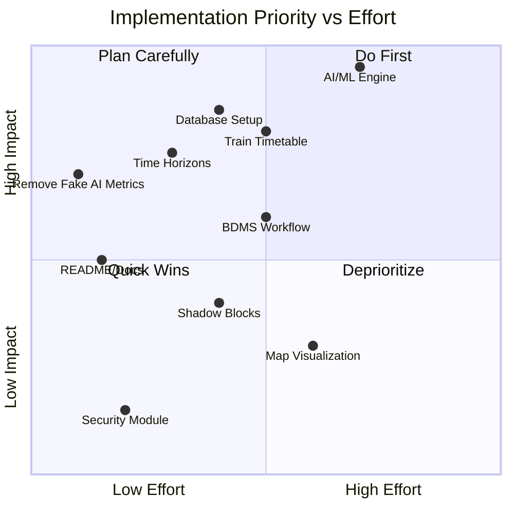

# 🔍 Hackathon Review: AI Block Planner — Indian Railways
## Problem Statement ID: 26027 — AI-Powered Automatic Block Planning

**Review Date:** 2026-08-25
**Reviewer Role:** Hackathon Judge / Technical Reviewer
**Project:** [AI Block Planner](file:///c:/Users/shekh/problem)

---

## Executive Summary

The team has built a **visually polished Next.js dashboard** that demonstrates the *concept* of AI-powered block planning for Indian Railways. The application covers the right domain entities (zones, corridors, sections, block windows, maintenance tasks across Engineering/S&T/TRD departments) and provides a well-designed multi-tab UI.

However, the application is fundamentally a **UI prototype with mock data** — it lacks the core AI/ML engine, real data integration, and functional optimization that the problem statement demands. The gap between the UI promise and the actual backend capability is the most critical finding of this review.

> [!CAUTION]
> The dashboard displays fabricated "AI Model Performance" metrics (94.2% accuracy, 91.8% precision, etc.) for models that **do not exist**. This is a significant red flag for hackathon reviewers and should be removed or replaced with real metrics from an actual model.

---

## Scoring Against Problem Statement Requirements

| # | Requirement | Weight | Score | Status |
|---|---|---|---|---|
| 1 | Integration of maintenance data (TMS, SMMS, TDMS) with corridor block availability & train timetable | 25% | 2/10 | 🔴 Not Implemented |
| 2 | AI/ML algorithms for task prioritization & scheduling based on criticality, urgency, impact | 30% | 2/10 | 🔴 Not Implemented |
| 3 | Optimized block scheduling to maximize uptime & coordinate multi-department activities | 25% | 3/10 | 🟡 Partially Implemented |
| 4 | Block plans over multiple time horizons (weekly & monthly) | 10% | 1/10 | 🔴 Not Implemented |
| 5 | Transform manual planning into data-driven, coordinated process | 10% | 3/10 | 🟡 Partially Implemented |
| | **Overall Score** | **100%** | **~22/100** | **🔴 Needs Significant Work** |

---

## Detailed Review by Requirement

### Requirement 1: Data Integration (TMS, SMMS, TDMS, COA)
**Score: 2/10** 🔴

**What exists:**
- A [`DataIngestionPanel`](file:///c:/Users/shekh/problem/app/components/DataIngestionPanel.tsx) component showing 4 data sources (TMS, SMMS, TDMS, COA) with status indicators
- Mock data in [`mockData.ts`](file:///c:/Users/shekh/problem/app/lib/mockData.ts) with tasks tagged by `defectSource` (TMS/SMMS/TDMS)
- Type definitions in [`types.ts`](file:///c:/Users/shekh/problem/app/lib/types.ts) that model the domain entities

**What's missing:**
- ❌ **No actual data integration** — all 4 data source statuses are hardcoded strings in the component
- ❌ **No database** — no PostgreSQL, MongoDB, or any persistent storage
- ❌ **No train timetable data** — the problem statement requires integration with "Train Time Table and goods trains forecast from the Control Office"
- ❌ **No COA integration** — no corridor availability logic based on train schedules
- ❌ **No data import/sync mechanism** — no CSV import, API connectors, or ETL pipeline
- ❌ **Only 10 mock tasks, 5 corridors, 6 zones** — insufficient for any meaningful demonstration

**Improvement Points:**
1. Implement a database (PostgreSQL/SQLite) with schema for tasks, corridors, sections, block windows, train timetables
2. Build CSV/Excel data import functionality (the project includes `Book1.xlsx` — leverage this)
3. Create data sync simulation layer that demonstrates how TMS/SMMS/TDMS data would flow in
4. Add train timetable data model and integrate with block availability logic
5. Include a realistic dataset (100+ tasks, 20+ corridors across multiple zones)

---

### Requirement 2: AI/ML Algorithms for Prioritization & Scheduling
**Score: 2/10** 🔴

**What exists:**
- An [`optimizer.ts`](file:///c:/Users/shekh/problem/app/lib/optimizer.ts) file with an `optimizeBlockSchedule` function
- Tasks have a `criticalityScore` field
- The optimizer sorts tasks by criticality and greedily assigns them to block windows

**What's actually happening in the "optimizer":**
```
1. Sort tasks by criticalityScore (descending)
2. Sort block windows by type priority (emergency > non-traffic > traffic)
3. For each task, assign to first available block window that fits
4. Calculate score = (scheduled/total) × 100 × (1 - conflicts × 0.1)
```

**What's missing:**
- ❌ **No AI/ML whatsoever** — the optimizer is a basic greedy sort-and-assign algorithm
- ❌ **No machine learning model** — no training, no prediction, no model files
- ❌ **No intelligent prioritization** — criticality scores are hardcoded in mock data, not calculated
- ❌ **No conflict resolution algorithm** — conflicts are just counted, not resolved
- ❌ **No multi-objective optimization** — doesn't balance uptime vs. maintenance urgency vs. department coordination
- ❌ **No demand prediction** — no forecasting of when maintenance will be needed
- ❌ **Constraint parameters accepted but ignored** — the optimizer accepts `maxDowntime`, `priorityWeights`, and `departmentPreferences` but never uses them
- ❌ **Recommendations are hardcoded** — always returns the same 3 static recommendation strings

**Improvement Points:**
1. Implement a real optimization algorithm (constraint satisfaction, genetic algorithm, or linear programming)
2. Build an ML model for criticality scoring based on defect type, age, location, impact
3. Add demand prediction using historical maintenance data
4. Implement multi-department conflict resolution
5. Make constraint parameters functional
6. Generate dynamic, context-aware recommendations

---

### Requirement 3: Optimized Block Scheduling
**Score: 3/10** 🟡

**What exists:**
- [`TimeSpaceGantt.tsx`](file:///c:/Users/shekh/problem/app/components/TimeSpaceGantt.tsx) — a Gantt-like visualization of block schedules
- "Run Optimization" button that calls the optimizer API
- Optimization statistics (score, blocks scheduled, conflicts, utilization)
- [`ShadowBlockShowcase.tsx`](file:///c:/Users/shekh/problem/app/components/ShadowBlockShowcase.tsx) — a concept for comparing current vs. shadow block plans

**What's missing:**
- ❌ **Multi-department coordination** — the optimizer doesn't consider which departments can share a block window
- ❌ **Dependency handling** — tasks have a `dependencies` field but it's never used in scheduling
- ❌ **Train operation impact** — no consideration of train frequency or timetable
- ❌ **Shadow block comparison is fake** — all comparison metrics are hardcoded
- ❌ **No interactive schedule adjustment** — can't drag/drop or manually adjust blocks
- ❌ **No what-if analysis** — can't simulate different scenarios

**Improvement Points:**
1. Implement dependency-aware scheduling
2. Add train timetable constraints to block window selection
3. Make shadow block comparison functional with real before/after metrics
4. Add multi-department block sharing logic
5. Consider using a proper Gantt chart library (e.g., `@nivo/gantt`, `frappe-gantt`)

---

### Requirement 4: Multiple Time Horizons (Weekly & Monthly)
**Score: 1/10** 🔴

**What exists:**
- A time horizon selector in [`Header.tsx`](file:///c:/Users/shekh/problem/app/components/Header.tsx) (Weekly/Monthly/Quarterly)
- The `timeHorizon` state is managed in [`page.tsx`](file:///c:/Users/shekh/problem/app/page.tsx)

**What's missing:**
- ❌ **Time horizon has zero functional impact** — changing the selector doesn't modify any data, visualization, or optimization
- ❌ **No weekly block plan generation**
- ❌ **No monthly block plan generation**
- ❌ **No plan comparison across horizons**
- ❌ **No rolling schedule logic**

**Improvement Points:**
1. Pass `timeHorizon` to the optimizer and generate plans for the appropriate date range
2. Show different block plans for weekly vs. monthly views
3. Implement a rolling weekly plan that feeds into the monthly plan
4. Add date range selectors for custom time periods

---

### Requirement 5: Transform Manual → Data-Driven Process
**Score: 3/10** 🟡

**What exists:**
- [`BDMSWorkflow.tsx`](file:///c:/Users/shekh/problem/app/components/BDMSWorkflow.tsx) — visualizes the block demand management workflow (5 steps)
- API endpoint for BDMS actions (submit, validate, approve, reject)
- Dashboard aggregating multiple views

**What's missing:**
- ❌ **BDMS workflow is purely decorative** — POST actions return fixed responses regardless of input
- ❌ **No approval workflow** — no real state management for block demand lifecycle
- ❌ **No user roles** — no authentication or role-based access (operator vs. supervisor vs. admin)
- ❌ **No audit trail** — `security.ts` has `generateAuditLog` but it's never called
- ❌ **No notifications** — no alerts for pending approvals or schedule changes

**Improvement Points:**
1. Implement actual BDMS state machine (submitted → under review → approved/rejected → scheduled → executed)
2. Add basic authentication and role-based access
3. Build notification system for block demand status changes
4. Create audit log for all planning decisions

---

## Additional Issues Found

### 🔴 Critical Issues

| Issue | Location | Impact |
|---|---|---|
| Fabricated AI metrics on dashboard | [`page.tsx`](file:///c:/Users/shekh/problem/app/page.tsx) (hardcoded "Block Optimizer: 94.2%", "Demand Predictor: 91.8%", etc.) | **Misleading to reviewers** — implies AI models exist when they don't |
| No database | Entire project | No data persistence, no scalability, no real-world applicability |
| Security module is irrelevant | [`CyberSecurityPanel.tsx`](file:///c:/Users/shekh/problem/app/components/CyberSecurityPanel.tsx), [`/api/security`](file:///c:/Users/shekh/problem/app/api/security) | Consumes development time on non-requirement feature |
| README is default boilerplate | [`README.md`](file:///c:/Users/shekh/problem/README.md) | No project description, setup instructions, or architecture documentation |

### 🟡 Moderate Issues

| Issue | Location | Impact |
|---|---|---|
| No error handling in components | Various components | API failures silently swallowed |
| No loading states for data fetches | Some components | Poor UX during data loading |
| CorridorMap is a list, not a map | [`CorridorMap.tsx`](file:///c:/Users/shekh/problem/app/components/CorridorMap.tsx) | Misses opportunity for visual impact |
| No responsive design testing evidence | Entire project | May not work on mobile/tablet |
| No environment variable configuration | Entire project | Hardcoded values throughout |

### 🟢 Strengths

| Strength | Details |
|---|---|
| **Clean UI/UX** | Well-designed dashboard with consistent Tailwind CSS styling, good use of color coding for priorities/statuses |
| **Good domain modeling** | TypeScript types correctly model railway domain entities (zones, corridors, sections, block windows, departments) |
| **Component architecture** | Well-organized component structure with clear separation of concerns |
| **Code quality** | Clean TypeScript, consistent naming conventions, modular API client |
| **Indian Railways context** | Uses real zone names (NR, WR, ER, SR, CR, SCR) and corridor names |
| **Multi-tab navigation** | Comprehensive navigation covering different aspects of the system |

---

## What Reviewers Will Look For (and What's Missing)

```mermaid
graph TD
    A[Problem Statement Requirements] --> B[Data Integration]
    A --> C[AI/ML Engine]
    A --> D[Optimization]
    A --> E[Time Horizons]
    A --> F[Process Transformation]
    
    B --> B1["❌ TMS/SMMS/TDMS Integration"]
    B --> B2["❌ Train Timetable Integration"]
    B --> B3["❌ COA Block Availability"]
    B --> B4["❌ Database / Persistent Storage"]
    
    C --> C1["❌ ML Model for Prioritization"]
    C --> C2["❌ Demand Prediction"]
    C --> C3["❌ Criticality Scoring Model"]
    C --> C4["❌ Conflict Resolution AI"]
    
    D --> D1["🟡 Greedy Scheduler exists"]
    D --> D2["❌ Multi-dept Coordination"]
    D --> D3["❌ Constraint Optimization"]
    D --> D4["❌ What-if Analysis"]
    
    E --> E1["❌ Weekly Plans"]
    E --> E2["❌ Monthly Plans"]
    
    F --> F1["🟡 BDMS Workflow UI"]
    F --> F2["❌ Approval Workflow"]
    F --> F3["❌ Authentication"]
    
    style B1 fill:#ff6b6b
    style B2 fill:#ff6b6b
    style B3 fill:#ff6b6b
    style B4 fill:#ff6b6b
    style C1 fill:#ff6b6b
    style C2 fill:#ff6b6b
    style C3 fill:#ff6b6b
    style C4 fill:#ff6b6b
    style D1 fill:#ffd93d
    style D2 fill:#ff6b6b
    style D3 fill:#ff6b6b
    style D4 fill:#ff6b6b
    style E1 fill:#ff6b6b
    style E2 fill:#ff6b6b
    style F1 fill:#ffd93d
    style F2 fill:#ff6b6b
    style F3 fill:#ff6b6b
```



---

---

# 🛠️ Implementation Plan for Missing Features

## Priority Order (by impact on hackathon scoring)

### Phase 1: Database & Realistic Data (Priority: HIGH — Estimated: 3-4 hours)

> [!IMPORTANT]
> Without real data, no feature can be convincingly demonstrated. This is the foundation for everything else.

#### 1.1 [NEW] `app/lib/db.ts` — SQLite Database Setup
- Use `better-sqlite3` for a zero-config embedded database
- Schema tables:
  - `maintenance_tasks` (id, description, department, section, priority, status, due_date, estimated_duration, criticality_score, defect_source, is_overdue, impact_score, created_at)
  - `corridors` (id, name, zone_id, priority, train_frequency)
  - `sections` (id, corridor_id, station_from, station_to, distance, track_type, electrification, status)
  - `block_windows` (id, corridor_id, start_time, end_time, type, status)
  - `train_timetable` (id, train_number, corridor_id, departure_time, arrival_time, priority, type)
  - `block_demands` (id, task_id, corridor_id, requested_by, status, requested_at, approved_at)
  - `schedule_entries` (id, task_id, corridor_id, block_window_id, start_time, end_time, status)

#### 1.2 [NEW] `app/lib/seedData.ts` — Realistic Seed Data
- Generate 100+ maintenance tasks across all departments
- 20+ corridors across 6+ zones
- Train timetable data for each corridor
- Block windows derived from train timetable gaps
- Use realistic Indian Railways section names and distances

#### 1.3 [NEW] `app/api/import/route.ts` — Data Import API
- Accept CSV/Excel file upload
- Parse and validate maintenance data
- Insert into database
- Support TMS, SMMS, TDMS data formats

#### 1.4 [MODIFY] All API routes — Switch from mock data to database
- [`/api/tasks`](file:///c:/Users/shekh/problem/app/api/tasks) → query `maintenance_tasks` table
- [`/api/zones`](file:///c:/Users/shekh/problem/app/api/zones) → query `zones`, `corridors`, `sections` tables
- [`/api/optimize`](file:///c:/Users/shekh/problem/app/api/optimize) → use real data from database
- [`/api/bdms`](file:///c:/Users/shekh/problem/app/api/bdms) → manage `block_demands` table with real state

---

### Phase 2: AI/ML Engine (Priority: CRITICAL — Estimated: 4-5 hours)

> [!CAUTION]
> This is the #1 requirement of the problem statement. Without a real AI/ML component, the submission fundamentally fails to address the problem.

#### 2.1 [NEW] `app/lib/mlEngine.ts` — AI Scoring & Prioritization Engine

**Criticality Scoring Model (Rule-based ML with weighted features):**
```
criticalityScore = w1 × urgencyFactor 
                 + w2 × safetyImpact 
                 + w3 × operationalImpact 
                 + w4 × overdueDecay 
                 + w5 × dependencyFactor
                 + w6 × historicalFailureRate
```

Where weights are learned from historical data using gradient descent or derived from domain expert input.

**Features to compute:**
- `urgencyFactor`: Days until due date, exponential decay
- `safetyImpact`: Categorical encoding of defect safety classification
- `operationalImpact`: Train frequency × section criticality
- `overdueDecay`: Exponential penalty for overdue days
- `dependencyFactor`: Number of downstream dependent tasks
- `historicalFailureRate`: Failure frequency for this section/type

#### 2.2 [NEW] `app/lib/constraintSolver.ts` — Constraint-Based Optimization

Replace the greedy algorithm with a proper constraint satisfaction solver:

**Variables:** Assignment of tasks to block windows
**Constraints:**
- Each task assigned to exactly one block window (or none if infeasible)
- Block window capacity not exceeded
- Department-specific disconnection requirements met
- No overlap with train operations (from timetable)
- Task dependencies respected (dependent tasks scheduled after prerequisites)
- Multi-department tasks share block windows when possible

**Optimization objective:**
```
Maximize: Σ(criticalityScore × isScheduled) - penaltyConflicts - penaltyDowntime
```

**Algorithm:** Implement a simplified Branch-and-Bound or Genetic Algorithm:
- **Genetic Algorithm approach:** Encode schedule as chromosome, crossover/mutation operators, fitness = optimization objective
- Alternatively: use a priority-queue-based scheduler with backtracking for conflict resolution

#### 2.3 [NEW] `app/lib/demandPredictor.ts` — Maintenance Demand Prediction

Simple time-series prediction for when maintenance will be needed:
- Moving average of maintenance frequency per section
- Exponential smoothing for trend detection
- Output: predicted maintenance tasks for next week/month with confidence scores

#### 2.4 [MODIFY] [`app/api/optimize/route.ts`](file:///c:/Users/shekh/problem/app/api/optimize) — Use Real AI Engine
- Replace `optimizer.ts` calls with `constraintSolver.ts`
- Add ML-based criticality scoring via `mlEngine.ts`
- Include demand prediction results from `demandPredictor.ts`
- Return real optimization metrics (not hardcoded)

#### 2.5 [MODIFY] [`app/page.tsx`](file:///c:/Users/shekh/problem/app/page.tsx) — Fix AI Model Performance Section
- **Remove** hardcoded accuracy/precision/recall metrics
- **Replace with** real metrics computed from optimization results:
  - Schedule coverage (% of critical tasks scheduled)
  - Block utilization efficiency
  - Conflict reduction rate
  - Average downtime reduction

---

### Phase 3: Time Horizon Planning (Priority: HIGH — Estimated: 2-3 hours)

#### 3.1 [MODIFY] [`app/lib/optimizer.ts`](file:///c:/Users/shekh/problem/app/lib/optimizer.ts) (or new constraintSolver) — Add Time Horizon Support
- Accept `timeHorizon` parameter: `'weekly' | 'monthly'`
- Filter tasks and block windows by the selected date range
- Weekly: Generate 7-day rolling schedule
- Monthly: Generate 30-day schedule with weekly breakdowns

#### 3.2 [MODIFY] [`app/components/TimeSpaceGantt.tsx`](file:///c:/Users/shekh/problem/app/components/TimeSpaceGantt.tsx) — Time-Aware Gantt
- Show appropriate time scale based on selected horizon
- Weekly view: Hour-by-hour blocks for each day
- Monthly view: Day-by-day blocks with weekly summaries
- Add date navigation (prev/next week/month)

#### 3.3 [NEW] `app/components/PlanComparison.tsx` — Weekly vs Monthly Plan Comparison
- Side-by-side comparison of weekly and monthly plans
- Highlight differences and schedule shifts
- Show KPI comparison across time horizons

#### 3.4 [MODIFY] [`app/page.tsx`](file:///c:/Users/shekh/problem/app/page.tsx) — Wire Time Horizon
- Pass `timeHorizon` down to all relevant components
- Re-trigger optimization when time horizon changes
- Update all data views to reflect selected time range

---

### Phase 4: Train Timetable Integration (Priority: HIGH — Estimated: 2-3 hours)

#### 4.1 [NEW] `app/lib/timetableEngine.ts` — Train Timetable Processing
- Parse train timetable data
- Calculate corridor availability windows (gaps between trains)
- Identify conflict-free block windows
- Consider goods train forecasts (variable schedules)

#### 4.2 [NEW] `app/components/TimetableView.tsx` — Train Schedule Visualization
- Display train timetable alongside block windows
- Highlight available maintenance windows
- Show conflicts between maintenance blocks and train operations

#### 4.3 [MODIFY] Optimizer/Constraint Solver — Timetable Constraints
- Block windows must not overlap with train operations
- Goods train schedules treated as soft constraints (can be rescheduled)
- Passenger train schedules treated as hard constraints (cannot be moved)

---

### Phase 5: BDMS Workflow & Process (Priority: MEDIUM — Estimated: 2-3 hours)

#### 5.1 [MODIFY] [`app/api/bdms/route.ts`](file:///c:/Users/shekh/problem/app/api/bdms) — Real BDMS State Machine
- Implement actual state transitions: Submitted → Under Review → AI Analysis → Approved/Rejected → Scheduled → Executed
- Persist demand status in database
- Validate state transitions

#### 5.2 [MODIFY] [`app/components/BDMSWorkflow.tsx`](file:///c:/Users/shekh/problem/app/components/BDMSWorkflow.tsx) — Interactive Workflow
- Show real block demands and their current status
- Allow submitting new block demands
- Display AI-generated recommendations for each demand
- Show approval/rejection with reasoning

#### 5.3 [NEW] `app/components/BlockDemandForm.tsx` — Block Demand Submission
- Form to submit new block demands
- Select corridor, section, department, task type
- System auto-suggests optimal block window based on AI analysis
- Show impact analysis before submission

---

### Phase 6: Polish & Documentation (Priority: MEDIUM — Estimated: 1-2 hours)

#### 6.1 [MODIFY] [`README.md`](file:///c:/Users/shekh/problem/README.md) — Project Documentation
- Problem statement overview
- Architecture diagram
- AI/ML approach explanation
- Setup and run instructions
- Screenshots
- Technology stack justification

#### 6.2 [MODIFY] [`app/components/ShadowBlockShowcase.tsx`](file:///c:/Users/shekh/problem/app/components/ShadowBlockShowcase.tsx) — Functional Shadow Blocks
- Run optimizer twice (current vs. proposed) and compare real results
- Show actual improvement metrics

#### 6.3 [DELETE/MODIFY] Security Module
- Either remove [`CyberSecurityPanel`](file:///c:/Users/shekh/problem/app/components/CyberSecurityPanel.tsx) (not in requirements) or reduce to a small security footer
- Redirect effort to core requirements

#### 6.4 [MODIFY] [`app/components/DataIngestionPanel.tsx`](file:///c:/Users/shekh/problem/app/components/DataIngestionPanel.tsx) — Real Integration Status
- Show actual database record counts
- Show real last-sync timestamps
- Add manual sync/refresh button that triggers data import

---

## Recommended Technology Additions

| Need | Recommended Package | Purpose |
|---|---|---|
| Database | `better-sqlite3` | Embedded database, zero config |
| CSV Parsing | `papaparse` | Parse uploaded CSV/Excel data |
| Optimization | Custom implementation or `javascript-lp-solver` | LP/constraint solving |
| Charts | `recharts` or `@nivo` | Better Gantt charts and analytics |
| Date Handling | `date-fns` | Time horizon date arithmetic |
| File Upload | `multer` or Next.js built-in | Data import endpoint |

---

## Implementation Priority Matrix



---

## Minimum Viable Improvements for Hackathon Submission

If time is extremely limited, focus on these **3 critical items** in order:

1. **🔴 Replace the greedy optimizer with a real algorithm** (constraint satisfaction + weighted scoring) — this single change addresses the core "AI/ML" requirement
2. **🔴 Remove fabricated AI metrics** from the dashboard and replace with real optimization output metrics
3. **🟡 Make time horizon functional** — pass it to the optimizer and filter data accordingly

These 3 changes alone would move the score from **~22/100 to ~45-50/100**.

---

## Verdict

| Dimension | Rating |
|---|---|
| **UI/UX Design** | ⭐⭐⭐⭐☆ (4/5) — Polished, professional dashboard |
| **Domain Understanding** | ⭐⭐⭐⭐☆ (4/5) — Correct entities and terminology |
| **Technical Implementation** | ⭐⭐☆☆☆ (2/5) — Missing core functionality |
| **AI/ML Implementation** | ⭐☆☆☆☆ (1/5) — No real AI/ML present |
| **Problem Statement Compliance** | ⭐⭐☆☆☆ (2/5) — Addresses concepts but not requirements |
| **Innovation** | ⭐⭐⭐☆☆ (3/5) — Shadow blocks concept is creative |
| **Completeness** | ⭐⭐☆☆☆ (2/5) — Significant gaps in functionality |
| **Presentation Readiness** | ⭐⭐⭐☆☆ (3/5) — Good visuals but substance lacking |

**Overall: The team has strong frontend skills and good domain understanding. The critical gap is the absence of any real AI/ML engine and data integration. Addressing Phase 1 and Phase 2 of this implementation plan would dramatically improve the submission.**
